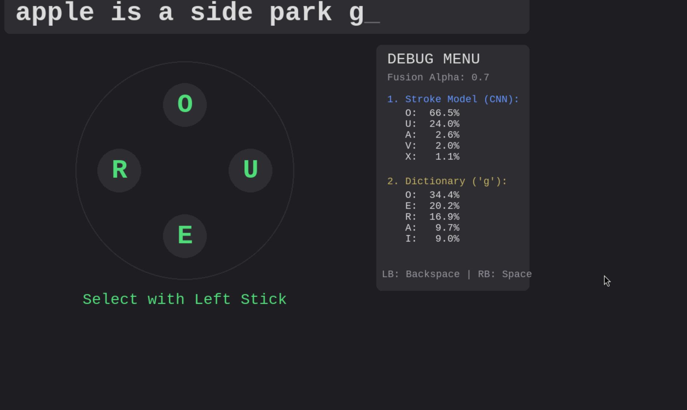

# StickTyping: Dual-Stick AI Keyboard 🎮⌨️

Welcome to **StickTyping**, an experimental unistroke smart-keyboard that brings fast and fluid text input to game controllers using a custom deep-learning hybrid engine! By combining sequential Neural Network classification with English Dictionary context, you can naturally sketch letters and type words using only two thumbsticks.

<video src="./screenrecording-2026-04-05_02-29-13.mp4" controls="controls" style="max-width: 800px; width: 100%;">
  Your browser does not support the video tag.
</video>

---

## 🎨 The Interfaces

### 1. The Typist Frontend (`type.py`)


The main application lets you sketch unistrokes with the **Right Stick**. Once you finish drawing a letter, the backend engine flashes the 4 most statistically likely characters onto the screen's radial menu. You flick the **Left Stick** to select the letter and add it to your word! 
*A real-time debug menu traces exactly how the Neural Network and the Dictionary arrived at their conclusions!*

### 2. The Data Collector (`xbox_draw/collector.py`)


To train the neural network, raw spatial sequence arrays are natively scraped directly from the analog Sticks using PyGame's Joystick module. By tracing the requested letters inside the deadzone boundary, it creates perfectly synced and labeled unistroke telemetry mapping (`stroke_data.json`).

---

## 🧠 Brains of the Operation (The Hybrid Engine)

Traditional controller grid-based keyboards are notoriously slow, and purely unistroke inputs can be wildly inaccurate. StickTyping solves this by fusing two distinct artificial intelligence pipelines into one seamless background evaluator inside `backend.py`.

### Pipeline A: Geometric Deep-Learning (TensorFlow Keras)
The raw `(x, y)` coordinate payloads from your thumbstick are noisy due to drifting human timing and scale.

1. **Spatial Resampling**: The input array is converted from an arbitrary time-based list into exactly **60 equispaced distance-based anchor points** (making identical shapes match even if drawn slow or fast).
2. **Derivative Computation**: A `np.gradient()` operation transforms raw coordinates into movement velocity differentials (`dx`, `dy`).
3. **The Recurrent Neural Network (RNN)**: The transformed coordinate shape `(60 points, 4 features)` is passed into Stacked **Bidirectional LSTMs**. By cascading through the stroke both backwards and forwards, the Keras model determines structural intent and fires a `softmax` array of 26 confidence probabilities.

### Pipeline B: The Context Dictionary (`pygtrie` + `wordfreq`)
If you hastily scribble a shape that looks both like an "e" and an "l", the Deep-Learning model might output ambiguous 50/50 probabilities. 

The **ContextEngine** utilizes a Trie data structure (`pygtrie`) pre-mapped with the English **Top 10,000 words** (`wordfreq`).
If your current text block is `"th"`, the engine climbs the branch for `"the"` and notes it holds a **massive** localized probability weight compared to `"thl"`. It emits a secondary probability map isolating characters configured to structurally make sense contextually.

### The Math (Alpha Fusioning)
Instead of hard-locking auto-correct boundaries like modern mobile keyboards—which can be irritating when typing slang—the `UnistrokeEngine` statistically blends both prediction pipelines together using the `ALPHA` parameter:

```python
Combined_Score = (ALPHA * Stroke_Probability) + ((1.0 - ALPHA) * Dictionary_Probability)
```
- An `ALPHA` of **0.7** means we heavily trust your raw drawing (70%), but we allow the dictionary **30% leverage** to nudge the outputs to actual English grammar if your thumbstick drawing felt sloppy!

---

## 💾 Running natively

### Requirements
You will need a python environment utilizing:
- `pygame`, `numpy`, `scipy`
- `tensorflow`
- `pygtrie`, `wordfreq`

### 1. Launching the Simulator:
Make sure your XInput gamepad is connected before launch!
```bash
python3 type.py
```

### 2. Updating the Artificial Intelligence model:
If you capture custom stroke arrays inside `xbox_draw/`, re-train the underlying recognizer by spinning up the AI scripts natively:
```bash
python3 train_and_save.py
```
