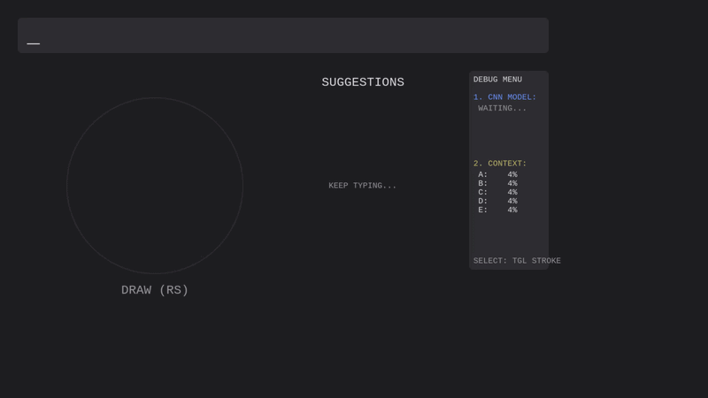
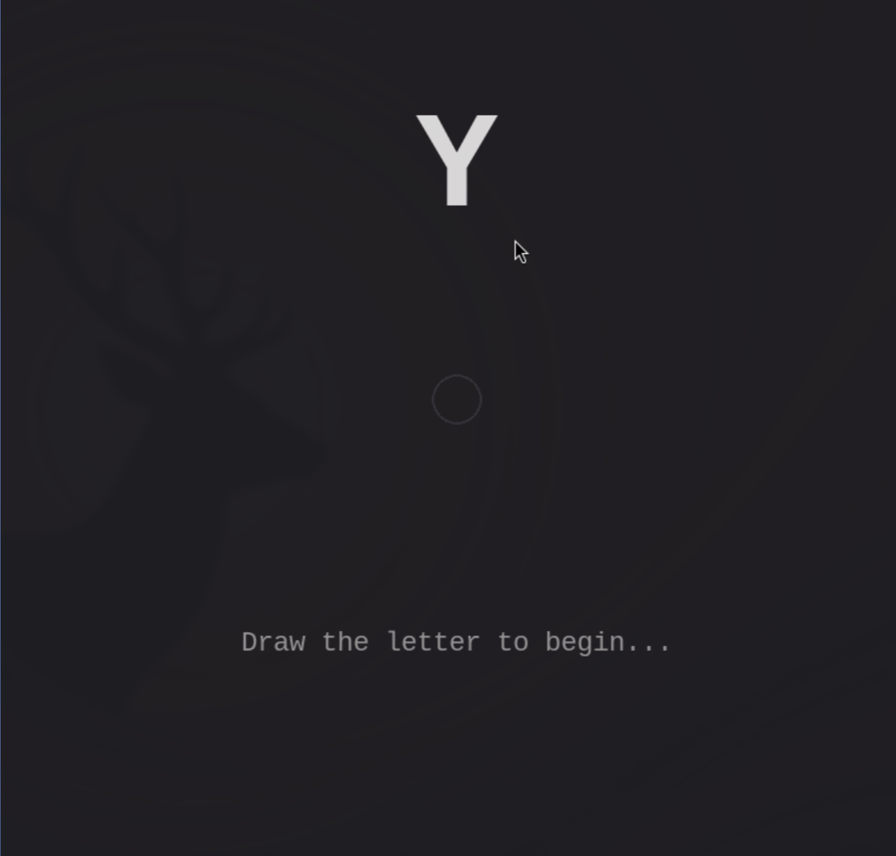

# StickTyping: Dual-Stick AI Keyboard

Welcome to **StickTyping**, an experimental unistroke smart-keyboard that brings fast and fluid text input to game controllers using a custom deep-learning hybrid engine. By combining sequential Neural Network classification with English Dictionary context, you can naturally sketch letters and type words using only two thumbsticks.

### Realtime Screenrecording


## Product Introduction

StickTyping serves as a proof of concept for replacing traditional on-screen grid keyboards for console systems. By utilizing dual thumbsticks, it allows users to experience a more natural, fluid typing interface that feels closer to handwriting than point-and-click hunting.

### Immersive Haptic and Audio Feedback
A core feature of the StickTyping experience is profound physical and acoustic feedback designed to enforce muscle-memory without requiring the user to continually look at the screen. High-definition controller rumbles signal specific input phases—such as entering the drawing boundary, completing a stroke, or successfully inputting a suggestion. This is paired with an underlying audio engine that produces distinct typing sounds, spatialized feedback tones, and auditory error-cues, helping you intuitively feel your spelling progress.

## The Hybrid Prediction Model

Traditional controller grid-based keyboards are notoriously slow, and purely unistroke inputs can be wildly inaccurate. StickTyping solves this by fusing two distinct artificial intelligence pipelines into one seamless background evaluator.

### 1. Geometric Deep-Learning (TensorFlow Keras)
The raw coordinate payloads from your thumbstick are inherently noisy due to natural variations in human timing and scale.
- **Spatial Resampling**: The input array is converted from an arbitrary time-based list into exactly 60 equispaced distance-based anchor points. This makes identical shapes match perfectly, regardless of how fast or slow they were drawn.
- **Derivative Computation**: A gradient operation transforms raw coordinates into movement velocity differentials.
- **Recurrent Neural Network (RNN)**: The transformed coordinate shape is passed into Stacked Bidirectional LSTMs. By cascading through the stroke both backwards and forwards, the Keras model determines structural intent and predicts the alphabetic confidence probabilities.

### 2. Context Dictionary and Word Suggestion
If you hastily scribble a shape that resembles both an "e" and an "l", the Deep-Learning model might output ambiguous probabilities.
The system utilizes a Trie data structure pre-mapped with the English Top 10,000 words. If your current text block is "th", the engine climbs the branch for "the" and notes it holds a massive localized probability weight compared to "thl", emitting a secondary probability map isolating characters mathematically likely to follow. 

**Smart Word Suggestion:** Once a word begins taking shape, the intelligent word suggestion system proactively flashes complete word completions onto the radial menu, allowing you to flick the Left Stick to autocomplete the rest of the word, drastically boosting your overall words-per-minute.

### Alpha Fusioning
Instead of hard-locking auto-correct boundaries like modern mobile keyboards, StickTyping statistically blends both prediction pipelines together using a configurable ALPHA parameter. An ALPHA of 0.7 heavily weighs your raw drawing (70%), while allowing the dictionary 30% leverage to nudge the results toward actual English grammar if your thumbstick drawing was messy.

## The Interfaces

### 1. The Typist Frontend
The main application lets you sketch unistrokes with the Right Stick. Once you finish drawing a letter, the backend engine flashes the 4 most statistically likely characters (or complete word suggestions) onto the screen's radial menu. You flick the Left Stick to select the letter and add it to your phrase.

### 2. The Data Collector

To train the neural network, raw spatial sequence arrays are natively scraped directly from the analog Sticks using PyGame's Joystick module. By tracing the requested letters inside the deadzone boundary, it creates perfectly synced and labeled unistroke telemetry mapping (`stroke_data.json`).

## Running Natively

### Requirements
You will need a Python environment utilizing:
- `pygame`, `numpy`, `scipy`
- `tensorflow`
- `pygtrie`, `wordfreq`

### Launching the Application
Make sure your XInput gamepad is connected before launch.
```bash
python3 type.py
```

### Updating the Artificial Intelligence Model
If you capture custom stroke arrays, re-train the underlying recognizer by spinning up the AI scripts natively:
```bash
python3 train_and_save.py
```
